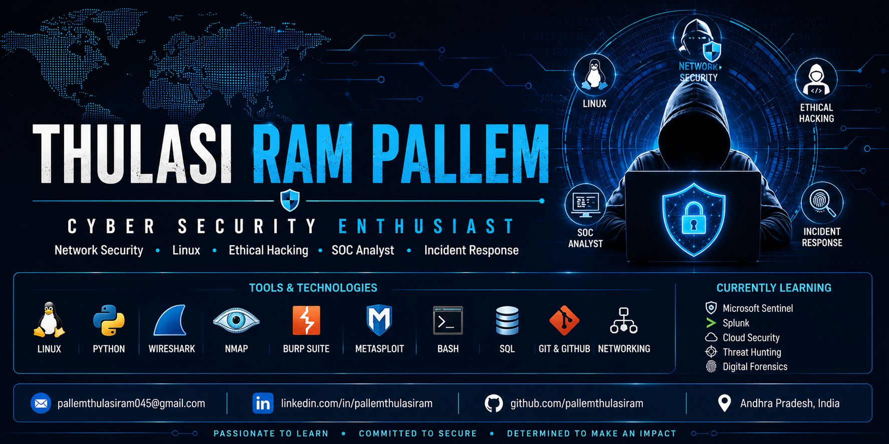

  

<h1 align="center">Hi 👋, I'm Pallem Thulasi Ram</h1>

<h3 align="center">Cyber Security Enthusiast | MCA (Cyber Security) | Aspiring SOC Analyst</h3>

---

## 👨‍💻 About Me

I am an MCA graduate specializing in **Cyber Security** with a strong interest in:

- 🔐 Cyber Security
- 🛡️ Network Security
- 🐧 Linux Administration
- 💻 Python for Security
- 🕵️ Ethical Hacking
- 📊 Security Operations Center (SOC)
- ☁️ Cloud Security
- 🚨 Incident Response

I enjoy building hands-on cybersecurity labs and documenting my learning through GitHub projects.

---

## 💻 Tech Stack

---

## 📂 Featured Projects

- 🐧 Linux for Cyber Security
- 🐍 Python for Cyber Security
- 🌐 Network Security Labs
- 🛡️ Ethical Hacking Notes
- 📈 SOC Labs

---

## 📜 Certifications

- Cisco Introduction to Cybersecurity
- Cisco Cybersecurity Essentials
- IBM Cybersecurity Fundamentals
- Fortinet Certified Fundamentals
- Palo Alto Cybersecurity Foundation

---

## 🌱 Currently Learning

- Microsoft Sentinel
- Splunk
- Threat Hunting
- Incident Response
- Digital Forensics
- Cloud Security

---

## 📫 Connect with Me

📧 **Email:** pallemthulasiram045@gmail.com

💼 **LinkedIn:** https://www.linkedin.com/in/pallemthulasiram/

🐙 **GitHub:** https://github.com/pallemthulasiram045-eh

---

⭐ **"Learning, Building, and Growing in Cyber Security Every Day."**
